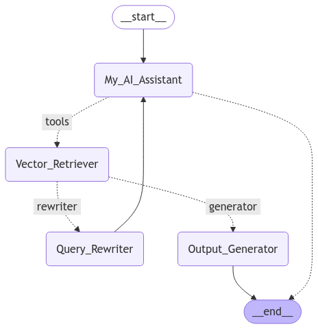

# Agentic RAG System

This repository contains an implementation of an Agentic Retrieval-Augmented Generation (RAG) system using LangChain and LangGraph. The system enhances traditional RAG by adding decision-making capabilities to improve query understanding and document relevance.

## Architecture



The workflow follows these steps:

1. **AI Agent**: Processes the user query and decides whether to retrieve information
2. **Retriever**: Fetches relevant documents from the vector store
3. **Document Grader**: Evaluates if retrieved documents are relevant to the query
4. **Generator**: Creates a response based on retrieved documents
5. **Query Rewriter**: Reformulates queries that didn't yield relevant documents

## Features

- Uses Groq's Gemma2-9b-It model for AI reasoning
- HuggingFace embeddings (All-MiniLM-L6-v2) for document vectorization
- Document chunking with RecursiveCharacterTextSplitter
- Vector storage with Chroma
- Relevance evaluation with a binary grading system
- Query reformulation for improved search results
- Robust tool handling with proper AIMessage formatting
- User-friendly output display helpers

## Requirements

- Python 3.10 or higher
- Dependencies listed in requirements.txt:
  - langgraph
  - langchain
  - langchain_community
  - langchain_huggingface
  - langchainhub
  - langchain_groq
  - ipykernel
  - dotenv
  - bs4
  - tiktoken
  - chromadb
  - IPython

## Setup

1. Clone this repository
```bash
git clone https://github.com/Zoro-chi/agentic-rag.git
cd agentic-rag
```

2. Create and activate a conda environment
```bash
conda create -n agentic-rag python=3.10
conda activate agentic-rag
```

3. Install dependencies
```bash
pip install -r requirements.txt
```

4. Create a `.env` file with your API keys
```
GROQ_API_KEY=your_groq_api_key
```

5. Run the Jupyter notebook
```bash
jupyter notebook agentic_rag.ipynb
```

## Usage

The system can be used in two ways:

### Basic Usage
```python
# Define your question
messages = [HumanMessage(content="What is the difference between RAG and LLMs?")]

# Invoke the app
result = app.invoke({"messages": messages})

# Print the final result in a readable format
print("\n=== FINAL ANSWER ===\n")
if "messages" in result:
    final_messages = result["messages"]
    if final_messages and len(final_messages) > 0:
        final_msg = final_messages[-1]
        if hasattr(final_msg, "content") and final_msg.content:
            print(final_msg.content)
```

### Simplified Usage with Helper Function
```python
# Using the display helper function
display_rag_result("What is the difference between RAG and LLMs?")
```

## How It Works

1. The AI agent processes the user query and creates a properly formatted AIMessage with tool calls
2. The retriever searches for relevant documents in the vector store using the formatted query
3. The document grader determines if the retrieved documents are relevant:
   - If relevant, the query and documents are passed to the generator
   - If not relevant, the query is sent to the rewriter to reformulate it
4. The system returns a comprehensive response based on the retrieved information
5. The display helper function extracts and presents the final answer in a readable format

## Advanced Features

### Custom Tool Message Handling

The system includes robust tool message handling to ensure proper communication between components:

```python
def create_tool_message(query: str, tool_name: str = "agentic_rag_retriever") -> AIMessage:
    """Create an AIMessage with tool calls format needed by ToolNode"""
    return AIMessage(content="", tool_calls=[{
        "name": tool_name,
        "id": "call_" + tool_name,
        "args": {"query": query},
        "type": "function"
    }])
```

### Simplified Routing

The workflow uses a direct routing approach that avoids common LangGraph tool condition errors:

```python
def route_based_on_messages(state: dict[str, Any]) -> str:
    """A simplified routing function that doesn't rely on tools_condition"""
    # Route based on next_step field or message count
    if "next_step" in state and state["next_step"]:
        return state["next_step"]
    # Default routing logic for first-time queries
    return "agentic_rag_retriever"
```
